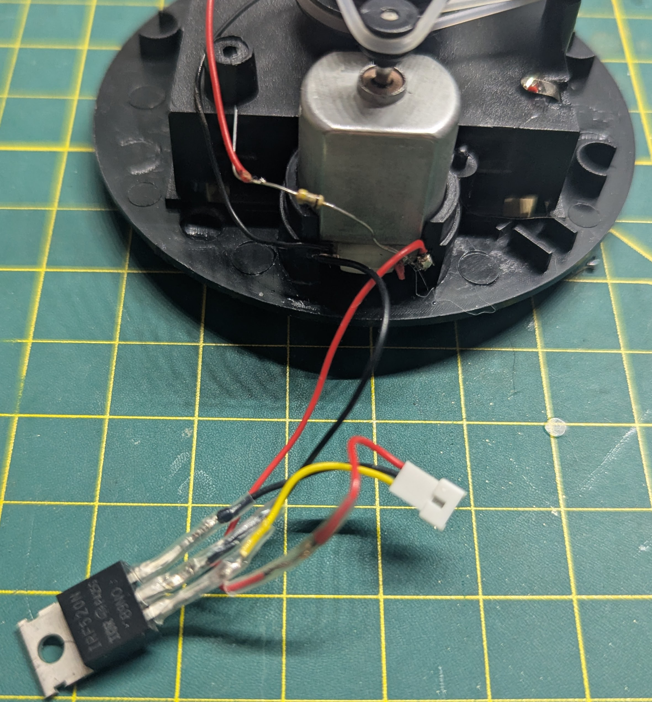

# CircuitPyGoalBeacon

## Parts List

### Electronics
- [Adafruit QT Py ESP32-S2 WiFi Dev Board with STEMMA QT](https://www.adafruit.com/product/5325)
- [Adafruit 1.14" 240x135 Color TFT Display](https://www.adafruit.com/product/4383)
- [Rotating Red Flashing Beacon Party Lamp](https://www.amazon.com/dp/B0D6BXT4DT)
- [N-channel power MOSFET](https://www.adafruit.com/product/355)

### Connectors and Hardware
- [1.25mm Pitch 6-pin Cable Matching Pair](https://www.adafruit.com/product/4986)
- [1.25mm Pitch 3-pin Cable Matching Pair](https://www.adafruit.com/product/4721)
- [Cutting board feet](https://www.amazon.com/dp/B0D97B6VCN)
- [USB-C Cable](https://www.adafruit.com/product/5788)
- [Brass M2.5 Standoffs](https://www.amazon.com/dp/B01L06CUJG) *Note: I happened to already have this kit on-hand when I built the prototype. We only need 2x5mm M2.5 brass standoffs and 2xM2.5 nuts for this project. If you are able to source those affordably without ordering the entire kit, it may be a better option.*

### Tools
- Phillips head screwdriver
- Needle nose pliers
- Wire strippers
- Hot glue gun and glue
- Soldering iron and solder
- Shrink tube or electrical tape

## Assembly

### Prepare the Light
*At this point it's a good idea to insert batteries and test the light out before preceding. If it doesn't work, it's going to be very difficult to return after following these instructions.*
1. Take the red dome off the base by removing the three screws around the outside.
2. Remove the reflector from inside with a firm tug.
3. Open the battery compartment on the bottom and remove the two screws inside. The base will now come apart into two pieces.
4. Clip the wires connecting the on/off switch to the rest of the internals and remove the switch from the housing.  Clip off the three leads from the switch and set them aside.
5. Clip off the red lead that runs from the right terminal of the motor to the positive contact of the battery compartment.
6. Clip the black lead attaching the LED to the ground contact of the battery compartment.
7. Solder the black lead to the left side of the motor and remove the red lead that is currently attached there.
8. Using one of the red leads you clipped off the switch earlier, solder one end to the right terminal of the motor and leave the other side loose.
9. Using one of the black leads you clipped off the switch earlier, solder one end to the left terminal of the motor and leave the other side loose.

Things should now look like this with two black wires soldered to the left side of the motor and two red wires soldered to the right side.

### Electronics Assembly
The overall layout of the connections can be seen here. 

1. Using the male end of the 6-pin connector set, solder the wires to the QT Py board in this configuration:

|Color|Pin label  |
|--|--|
| Red | 5V |
| Black | GND |
| Blue | SCK|
| Green | M0|
| White | A0|
| Yellow | A1|

3. Next we'll be connecting the male end of the 3-pin connector. In the diagram above, the third wire of this connector is shown as orange, but it may be another color such as yellow or blue on yours. It will be whichever wire isn't red or black. Solder the wires to the QA Py board in this configuration:

|Color|Pin label  |
|--|--|
| Red | 5V |
| Black | GND |
| Orange | A2|

5. Now we'll attach the female end of the 6-pin connector to the display. Solder the wires to the pins in this configuration:

|Color|Pin label  |
|--|--|
| Red | Vin |
| Black | GND |
| Blue | SCK|
| Green | MOSI|
| White | TFTCS|
| Yellow | DC|

7. Next we'll attach the female end of the 3-pin connector like this. Apply shrink tube or electrical tape to these connections to avoid shorts.

| Color | Pin label  |
|--|--|
| Red | The red wire of your light|
| Black | NPN Transistor base (rightmost) pin|
| Orange | NPN Gate (leftmost) pin |

9. Finally, complete the circuit by connecting the light's black wire to the transistor's drain (center) pin.

At this point, your components should look something like this:

6. Connect the two ends of the 3-pin connector.

7. Thread the USB cable through the hole that was previously used by the tab on the battery compartment lid and tie a loose knot for strain relief. Connect it to the UBC-C port on the QT Py board.

8. Thread the male end of the 7-pin connector through the hole in the base left by the switch we removed so that the display sits outside. 

9. Connect the two ends of the 7-pin connector.
 
## Upload the Code
1. Connect the board to your computer's USB port. The board should automatically appear as flash drive named **CIRCUITPY**. 
2. Download this repository.

Choose one of the methods below to upload the project code.
### Option A (Easy)
Use a web tool such as https://adafruit.github.io/Adafruit_WebSerial_ESPTool/ to flash the included .bin file to the board. 
1. Place the board in flash mode by holding the "Boot" button and clicking the "Reset" button then releasing both buttons.
2. Click the "Connect" button on the flash tool and follow the instructions to flash .bin file in the root of this repository.

### Option B (Advanced)
Manually update the board firmware and upload the project.

#### 1.  Update the Board
CircuitPython version 10 or higher is required to run this project. Use the [CircuitPython online update tool](https://circuitpython.org/board/adafruit_qtpy_esp32s2/) to install the latest CircuitPython image. For detailed instructions and other methods of firmware updating, see the [Adafruit Factory Reset and Bootloader Repair](https://learn.adafruit.com/adafruit-qt-py-esp32-s3/factory-reset#factory-reset-and-bootloader-repair-3107941) documentation.

#### 2.  Upload the Code
Copy the contents of the code directory onto your board. I have found that files may get corrupted if I try to transfer too many at once, so you may want to do this one file at a time.

### User Configuration
Your display should now show an error message that the settings.toml is invalid due to missing wifi credentials. Open your **CIRCUITPY** drive and then open the settings.toml file in a text editor. Fill in the required blank fields, you should also take this opportunity to set your desired custom settings.

#### settings.toml fields
| Field Name | Description |
|--|--|
|**User Settings**||
| WIFI_NAME | SSID of the wifi network |
| WIFI_PASSWORD| Password of the wifi network |
| LOCAL_TIME_ZONE| Local timezone IANA designation |
| WATCH_TEAM_CODE| The team code you want to track. See "teams.md" for a full list |
| COUNTRY_CODE| Either "US" or "CA". Used when determining which tv channels are available to you. |
| LOCAL_TIMEZONE_OFFSET| Time in seconds that your local timezone is offset from UTC |
| TV_CHANNEL_LIST| A comma separated filter list for TV channels. If this is blank, the local and/or national broadcast for your team will be displayed. If it is set, only channels in the list will be displayed.|
| COUNTRY_CODE| Either "US" or "CA". Used when determining which tv channels are available to you. |
|**Advanced Settings**||
| GOAL_ALERT_LENGTH | The number of seconds the light will remain on after a goal is scored |
| GOAL_ALERT_COLOR_1 | Background/text color of the "Goal!" sprint that flashes on the display. |
| GOAL_ALERT_COLOR_2 | Alternate background/text color of the "Goal!" sprint that flashes on the display. | 
| SYNC_TIMEZONE_WITH_API | If "False" then the LOCAL_TIMEZONE_OFFSET will be used to determine the local time. If "True" we will attempt to synchronize the offset using an external API. This is useful to adjust for daylight savings changes automatically. | Yes |
| TIMEZONE_API | The timezone API to use if SYNC_TIMEZONE_WITH_API is "True". Only the current default value has been tested at this time.  |
| TIMEZONE_API_KEY | The API key required to access the timezone API. This can be acquired by registering an account at https://rapidapi.com/sleeyax/api/world-time-api3 |
|**Developer Settings**||
| NTP_SERVER_LIST | Comma separated list of NTP servers to try in order when initializing the current time.|
| API_BASE | The root url for the NHL data API|
| TIME_DEBUG_MODE | If "False" execute normally. If "True" the SYNC_TIMEZONE_WITH_API is ignored and assumed "False". This is useful if you are resetting frequently as during development and don't want to wait for this sync.|
| GAME_WATCH_DEBUG_MODE | If "False" execute normally. If "True" the next scheduled game will have it's start time changed to start immediately and goals will automatically be triggered every few seconds. This is useful for debugging game events without waiting for a game to start.|

### Final Assembly
